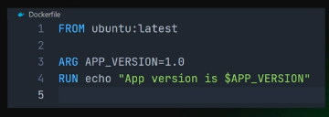
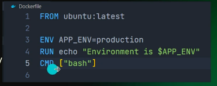
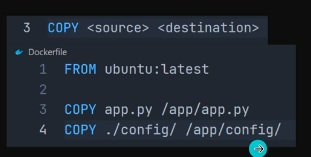
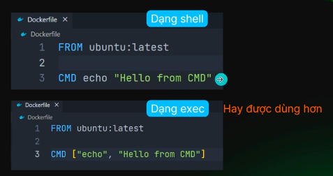
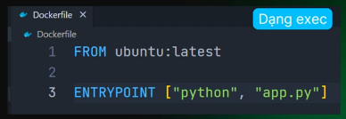
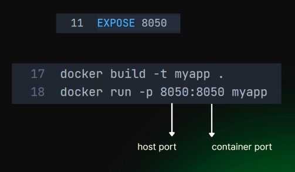

# Docker Instructions

1. Khái niệm :

- là các chỉ thị (lệnh) được viết trong file Dockerfile để hướng dẫn Docker cách xây dựng một image. Mỗi instruction là một từ khóa viết in hoa ( ví dụ: FROM, COPY, CMD, ...) thường đi kèm với tham số.
- Mỗi instruction tương ứng với một bước tạo ra image

- **_Example_**:
  `FROM python:3.9-slim` : chỉ thị base image
  `WORKDIR /app`: thiết lập thư mục làm việc
  `COPY requirement.txt` or `COPY ..`: Sao chép file từ host
  `RUN pip install -f requirement.txt`: Thực thi câu lệnh build image
  `EXPOSE 8000`: Khai báo port mà container lắng nghe
  `CMD["uvicorn", "main:app", "--host", "0.0.0.0", "--port", "8000"]`: Lệnh mặc định khi container khởi động

2. Một số docker instructions:

- **`LABEL`**: Để gắn metadata ( siêu dữ liệu ) cho image ( dưới dạng cặp key-value )

  - Thêm thông tin mô tả cho image như version, ai tạo ra, mục đích ...
  - Giúp việc tìm kiếm sau này dễ hơn
    

- **`ARG`**: Khai báo biến

  - Định nghĩa biến chỉ được sử dụng trong quá trình docker build ( build docker image từ docker file )
  - Cho phép truyền giá trị vào khi build bằng **`--build-arg`**
  - Sau khi build xong, container không thể truy cập biến **`ARG`**
    

- **`ENV`**: Khai báo biến

  - Khai báo biến môi trường trong image
  - Biến này tồn tại trong cả quá trình build lẫn khi container chạy
  - Biến môi trường được khai báo bằng \*_ENV_ có thể bị ghi đè khi chạy container bằng cách sử dụng cờ -e hoặc --env trong lệnh --env trong lệnh `docker run`
    Có thế kiểm tra bằng `docker inspect container_name-or-id`
    

- **`COPY`**:

  - _command line: `COPY <source> <destination>`_
  - Chỉ sao chép file/folder
  - Không xử lý file .tar, không tải từ url
  - Đơn giản, rỡ ràng, nên được ưu tiên sử dụng trong hầu hết trường hợp
    Có thế kiểm tra bằng `docker inspect container_name-or-id`
    

- **`ADD`**: Ngoài việc sao chép file giống như `COPY`, `ADD` còn:

  - _command line: `ADD <source> <destination>`_
  - Tự động giải nén source là .tar, .tar.gz
  - Hỗ trợ URL - có thể tải file từ internet.
    

- **`CMD and ENTRYPOINT`**: đều được dùng đẻ chỉ định lệnh mặc định chạy khi container được khởi động

  - **`CMD`** - lệnh mặc định có thể ghi đè
  - Bị ghi đè nếu truyền giá trị mới khu chạy `docker run`
  - ex: **`docker run ubuntu echo "Hello anh em"`**
    

  - **`ENTRYPOINT`** - lệnh cố định, khó bị ghi đè
  - Xác định lệnh chính và cố định mà container luôn chạy
  - Nếu truyền đối số khi chạy container, nó sẽ gắn vào sau lệnh **`ENTRYPOINT`**
    

- **`EXPOSE`** - được dùng để khai báo ( mô tả ) cổng ( port ) mà container sẽ dùng để giao tiếp bên ngoài
  - Tài liệu hóa cổng trong image, giúp người khác biết ứng dụng lắng nghe trên cổng nào ?
  - **_Không có tác dụng mở cổng thực sự_** - để ứng dụng khả dụng từ bên ngoài phải dùng -p khi chạy container ( chính là port mapping ) ( _command line: `docker run -p 8050:8050 myapp_`)
    
